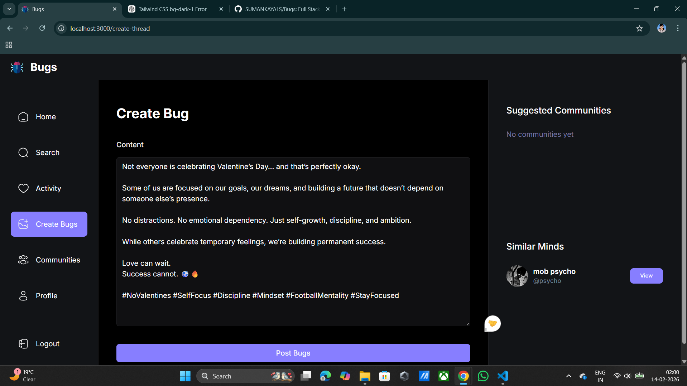
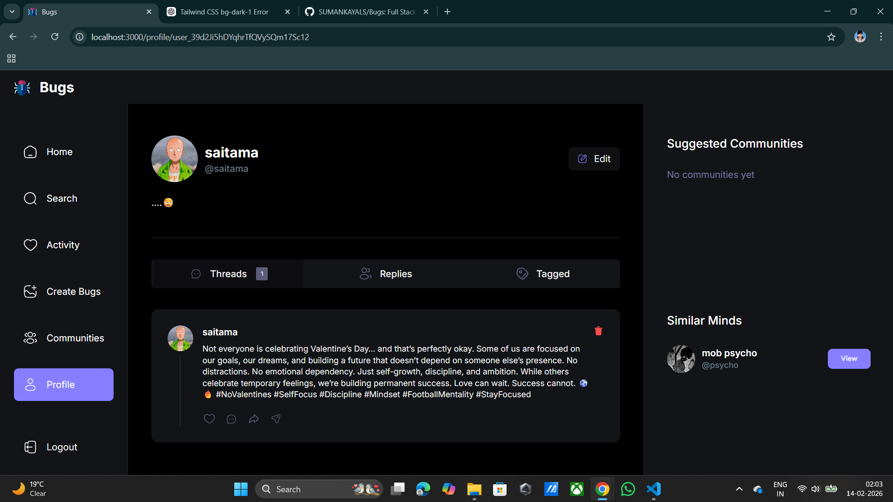

# 🧵 Threads Clone – Full Stack Social Media App

A modern full-stack Threads clone built with **Next.js 13**, **Clerk Authentication**, **MongoDB**, and **Tailwind CSS**.
This app allows users to sign up, create profiles, post threads, and interact in a clean social media interface.

---

## 🚀 Features

* 🔐 Authentication with Clerk (Email Sign-In & Sign-Up)
* 👤 User onboarding and profile creation
* 🧵 Create and view threads
* 🧭 Sidebar navigation (Left, Right, Top, Bottom)
* 🌙 Dark theme UI
* ⚡ Fast performance with Next.js App Router
* 🎨 Modern UI with Tailwind CSS
* 🗄️ MongoDB database integration
* 🔒 Protected routes using Clerk Middleware

---

## 🛠️ Tech Stack

**Frontend:**

* Next.js 13 (App Router)
* React
* Tailwind CSS

**Backend:**

* Next.js Server Actions
* MongoDB
* Mongoose

**Authentication:**

* Clerk Auth

**Deployment:**

* Vercel (Recommended)

---

## 📁 Project Structure

```
threads-main/
│
├── app/
│   ├── (auth)/
│   │   ├── sign-in/
│   │   ├── sign-up/
│   │   └── onboarding/
│   │
│   ├── (root)/
│   │   ├── layout.tsx
│   │   └── page.tsx
│   │
│   ├── api/
│   ├── icon.svg
│   └── globals.css
│
├── components/
├── lib/
│   ├── mongoose.ts
│   └── models/
│
├── public/
├── middleware.ts
├── tailwind.config.js
└── package.json
```

---

## ⚙️ Environment Variables

Create a `.env.local` file in the root directory:

```
NEXT_PUBLIC_CLERK_PUBLISHABLE_KEY=your_publishable_key
CLERK_SECRET_KEY=your_secret_key

NEXT_PUBLIC_CLERK_SIGN_IN_URL=/sign-in
NEXT_PUBLIC_CLERK_SIGN_UP_URL=/sign-up
NEXT_PUBLIC_CLERK_AFTER_SIGN_IN_URL=/onboarding
NEXT_PUBLIC_CLERK_AFTER_SIGN_UP_URL=/

MONGODB_URL=your_mongodb_connection_string
```

---

## 🧪 Installation & Setup

### 1. Clone the repository

```
git clone https://github.com/SUMANKAYALS/Bugs
cd threads-clone
```

### 2. Install dependencies

```
npm install
```

### 3. Setup environment variables

Create `.env.local` and add your Clerk and MongoDB keys.

### 4. Run development server

```
npm run dev
```

App will run at:

```
http://localhost:3000
```

---

## 🔒 Authentication Flow

1. User signs up using Clerk
2. User redirected to onboarding
3. User profile saved in MongoDB
4. User can create and view threads

---

## 🗄️ Database Schema Example

User Model:

```
{
  clerkId: String,
  username: String,
  name: String,
  image: String,
}
```

---

## 📸 Screenshots

### 🏠 Home Page


### 👤 Create Bug


### 👤 Profile Page


---

## 🚀 Deployment

Deploy easily using:

* Vercel
* Netlify
* Railway

Recommended: **Vercel**

---

## 🧑‍💻 Author

**Sky (Suman Kayal)**
Full Stack Developer

---

## 📜 License

This project is licensed under the MIT License.

---

## ⭐ Support

If you like this project, please give it a ⭐ on GitHub!
